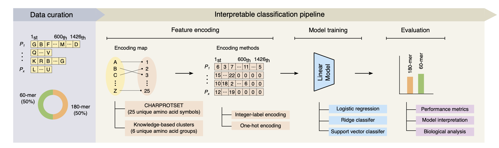

# Classifying the Stoichiometry of Virus-like Particles with Interpretable Machine Learning

## Introduction 
This repository contains the scikit-learn implementation of the pipeline, as shown below. 

## Pipeline

